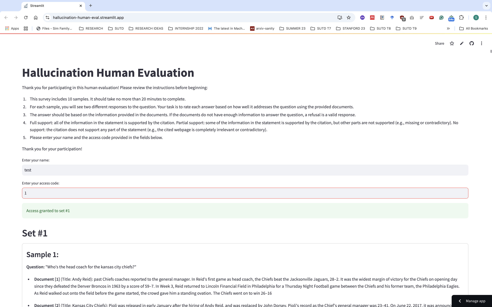
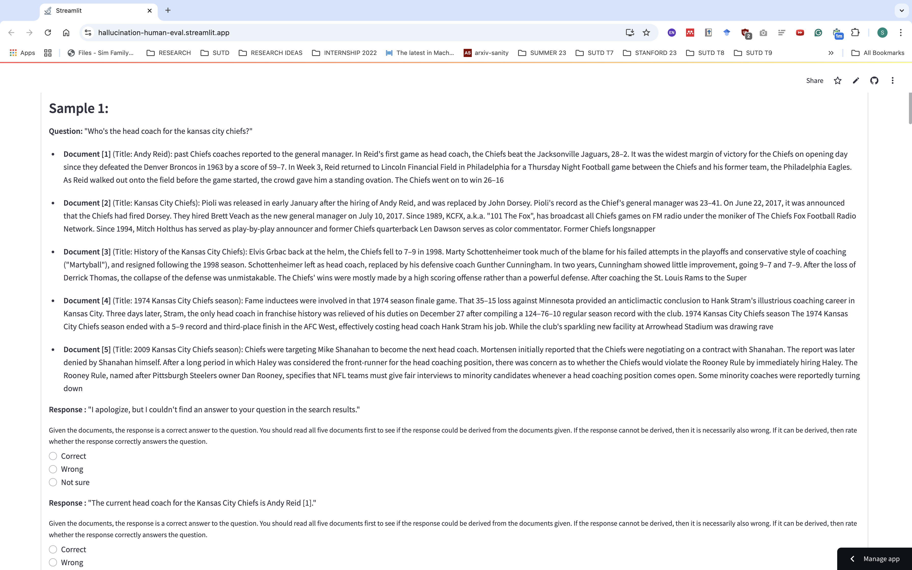

# Hallucination Human Evaluation Tool

This project provides a web-based interface built with Streamlit for collecting human annotator's ratings of model generated responses on three dimensions: (1) Correctness, (2) Citation recall, and (3) Citation precision. Responses collected through this interface are securely stored in Firebase for further analysis.

<div style="display: flex; justify-content: space-around;">
    
    
</div>


## Installation

### Install Dependencies

```bash
pip install -r requirements.txt
```

### Firebase Setup

To set up Firebase in this project, you'll need to generate a service account key file (`firebase-adminsdk-XXXXXX-XXXXXXXXXX.json`). Follow these steps:

1. **Log in to Firebase Console**:
   - Open your web browser and go to the [Firebase Console](https://console.firebase.google.com/).

2. **Select Your Project**:
   - Click on the project you want to use. If you don’t have a project, create one first.

3. **Access Project Settings**:
   - In the left-hand menu, click the gear icon ⚙️ next to **Project Overview**.
   - Select **Project Settings** from the dropdown menu.

4. **Go to the Service Accounts Tab**:
   - In the **Project Settings** page, click the **Service Accounts** tab at the top.

5. **Generate a Private Key**:
   - Under the **Firebase Admin SDK** section, click the **Generate New Private Key** button.
   - Confirm by clicking **Generate Key** in the dialog box.

6. **Download the JSON File**:
   - A file named `firebase-adminsdk-XXXXXX-XXXXXXXXXX.json` will be downloaded to your computer automatically.

7. **Move the File to Your Project**:
   - Place the file in a secure directory in your project, such as `config/` or `secrets/`.
   - Ensure the file path in your code matches its location.

8. **Secure the File**:
   - Add the JSON file to your `.gitignore` to prevent it from being uploaded to version control.
     ```plaintext
     # Add this to your .gitignore
     config/firebase-adminsdk-*.json
     ```
### Run app

```bash
streamlit run app.py
```

### Analyze results

See `visualize_results.ipynb` for example analysis

> Happy evaluating!